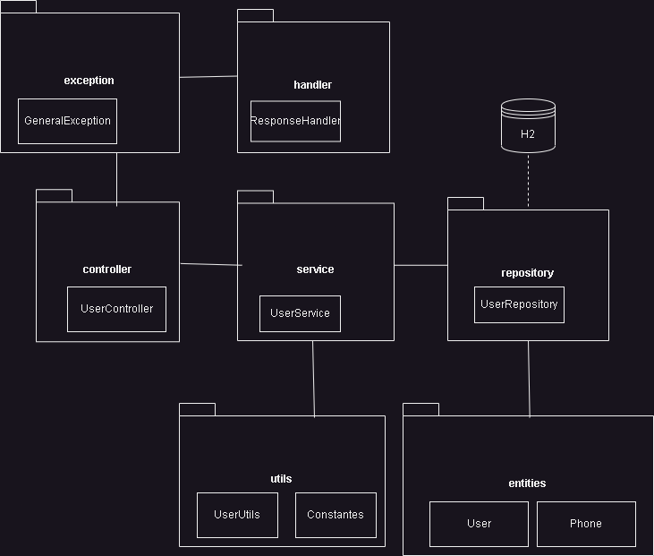

<details>
  <summary>request/response</summary>

</details>

# Usuarios-EY
Springboot API CRUD Usuarios
## Api
Creacion, lectura, edicion y borrado de usuarios.

Request y response solo en json

Emails habilitados solo del dominio "@dominio.cl"

Password minimo debe tener una mayuscula, tres letras minúsculas y dos numeros


### Crear usuarios
POST http://localhost:8080/api/users/create
<details>
  <summary>request/response</summary>

#### Request
```json
{ 
  "name": "Juan Rodriguez",
  "email": "juan@dominio.cl",
  "password": "hunterA22",
  "phones": [
    {
      "number": "1234567",
      "citycode": "1",
      "contrycode": "57"
    }
  ]
}
```
#### Response
```json
{
    "message": {
        "id": "7495a248-3841-4f8d-9fd5-b96bb8ac22ce",
        "name": "Juan Rodriguez",
        "email": "juan@dominio.cl",
        "password": "hunterA22",
        "created": "2023-06-18",
        "modified": "2023-06-18",
        "last_login": "2023-06-18",
        "token": "1c318b08-dd43-4d9a-883a-06b3f6e89c07",
        "isactive": "1",
        "phones": [
            {
                "id": 1,
                "number": "1234567",
                "citycode": "1",
                "contrycode": "57"
            }
        ]
    },
    "status": "200"
}
```
</details>


### Ver todos los usuarios
POST http://localhost:8080/api/users/all

<details>
  <summary>request/response</summary>
  
#### Request
```json
{"id":"all"}
```
#### RESPONSE
```json
{
    "message": [
        {
            "id": "7495a248-3841-4f8d-9fd5-b96bb8ac22ce",
            "name": "Juan Rodriguez",
            "email": "juan@dominio.cl",
            "password": "*********",
            "created": "2023-06-18",
            "modified": "2023-06-18",
            "last_login": "2023-06-18",
            "token": "1c318b08-dd43-4d9a-883a-06b3f6e89c07",
            "isactive": "1",
            "phones": [
                {
                    "id": 1,
                    "number": "1234567",
                    "citycode": "1",
                    "contrycode": "57"
                }
            ]
        }
    ],
    "status": "200"
}
```
</details>

### Ver un usuario
POST http://localhost:8080/api/users/find/

<details>
  <summary>request/response</summary>
  
#### Request
```json
{
    "id":"7495a248-3841-4f8d-9fd5-b96bb8ac22ce",
    "token":"1c318b08-dd43-4d9a-883a-06b3f6e89c07"
}
```
#### RESPONSE
```json
{
    "message": {
        "id": "7495a248-3841-4f8d-9fd5-b96bb8ac22ce",
        "name": "Juan Rodriguez",
        "email": "juan@dominio.cl",
        "password": "*********",
        "created": "2023-06-18",
        "modified": "2023-06-18",
        "last_login": "2023-06-18",
        "token": "1c318b08-dd43-4d9a-883a-06b3f6e89c07",
        "isactive": "1",
        "phones": [
            {
                "id": 1,
                "number": "1234567",
                "citycode": "1",
                "contrycode": "57"
            }
        ]
    },
    "status": "200"
}
```

</details>

### Modificar Usuarios
PUT http://localhost:8080/api/users/edit

<details>
  <summary>request/response</summary>

#### Request

```json

{ "id":"7495a248-3841-4f8d-9fd5-b96bb8ac22ce",
  "name": "Juan Rsodrigutezsss",
  "email": "jueeeean@dominio.cl",
  "token": "1c318b08-dd43-4d9a-883a-06b3f6e89c07"
}
```


#### Response
```json
{
    "message": {
        "id": "7495a248-3841-4f8d-9fd5-b96bb8ac22ce",
        "name": "Juan Rsodrigutezsss",
        "email": "jueeeean@dominio.cl",
        "password": "*********",
        "created": "2023-06-18",
        "modified": "2023-06-18",
        "last_login": "2023-06-18",
        "token": "1c318b08-dd43-4d9a-883a-06b3f6e89c07",
        "isactive": "1",
        "phones": [
            {
                "id": 1,
                "number": "1234567",
                "citycode": "1",
                "contrycode": "57"
            }
        ]
    },
    "status": "200"
}
```
</details>


### Eliminar usuarios
DELETE localhost:8080/api/users/delete

<details>
  <summary>request/response</summary>

#### Request
```json
{ "id":"7495a248-3841-4f8d-9fd5-b96bb8ac22ce",
  "token": "1c318b08-dd43-4d9a-883a-06b3f6e89c07"
}
```

#### Response
```json
{
    "message": "Usuario eliminado",
    "status": "200"
}
```

</details>

## Diagrama

